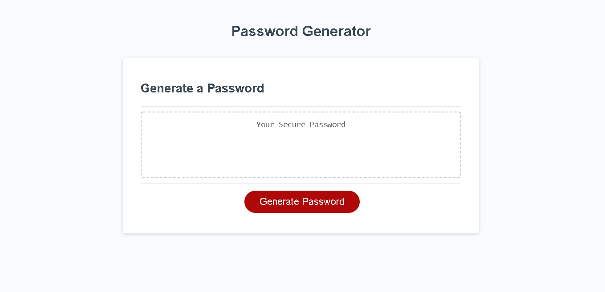
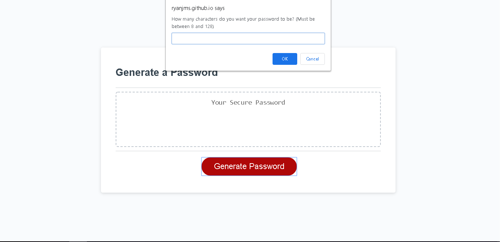
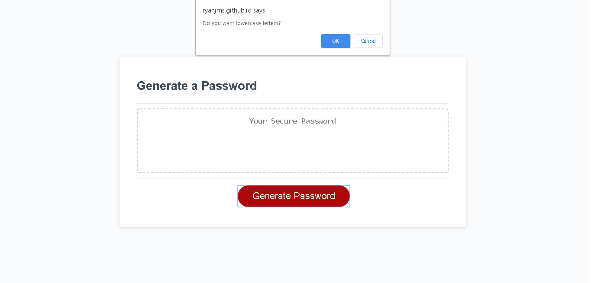
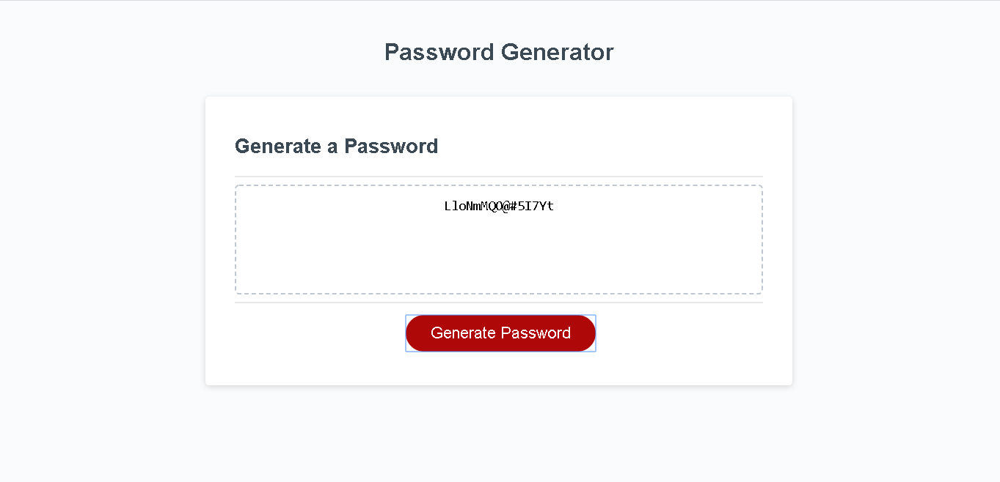

# Password Generator

This is a password generator built using HTML, Javascript, and styled with CSS

The user clicks on the generate password button, and it initiates the main script.

It first prompts the user to enter a desired password length between 8 and 128 characters.

The user then goes through 4 confirm boxes, to decide which character types to use.

Click here to visit the live site and give the application a try -- https://ryanjms.github.io/password_generator_hw3/

# Screenshots

